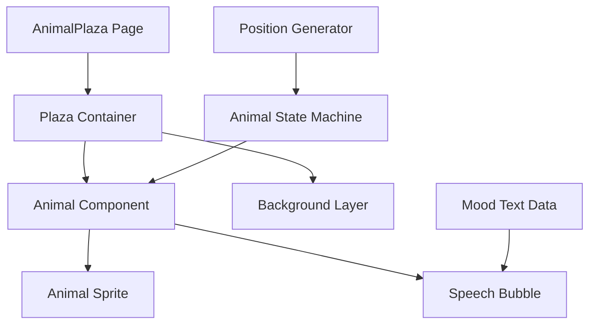

# Design Document: Animal Plaza

## Overview

动物广场是一个独立的 React 组件页面，展示一个虚拟广场场景。页面使用硬编码数据，包含多个小动物角色，它们在场景中随机移动，并不定时显示情绪气泡。整个实现基于 React + TypeScript，使用 CSS 动画实现平滑的视觉效果。

## Architecture



### 组件层次结构

1. **AnimalPlaza** - 主页面组件，管理所有动物的状态
2. **Plaza Container** - 广场容器，定义边界和背景
3. **Animal** - 单个动物组件，包含精灵和气泡
4. **SpeechBubble** - 气泡组件，显示情绪文字

## Components and Interfaces

### AnimalPlaza Component

```typescript
interface AnimalPlazaProps {
  // 无需外部props，数据全部硬编码
}

// 主页面组件
const AnimalPlaza: React.FC<AnimalPlazaProps>
```

### Animal Component

```typescript
interface Position {
  x: number;  // 0-100 百分比
  y: number;  // 0-100 百分比
}

interface AnimalProps {
  id: string;
  emoji: string;
  initialPosition: Position;
}

interface AnimalState {
  position: Position;
  isMoving: boolean;
  isFacingLeft: boolean;
  showBubble: boolean;
  currentMood: string | null;
}
```

### SpeechBubble Component

```typescript
interface SpeechBubbleProps {
  text: string;
  visible: boolean;
}
```

### Utility Functions

```typescript
// 生成随机位置（在边界内）
function generateRandomPosition(bounds: { minX: number; maxX: number; minY: number; maxY: number }): Position

// 生成随机持续时间
function generateRandomDuration(min: number, max: number): number

// 获取随机情绪文字
function getRandomMoodText(): string

// 计算移动方向
function calculateDirection(from: Position, to: Position): 'left' | 'right'
```

## Data Models

### 硬编码动物数据

```typescript
const ANIMALS: Array<{ id: string; emoji: string }> = [
  { id: 'cat', emoji: '🐱' },
  { id: 'dog', emoji: '🐶' },
  { id: 'rabbit', emoji: '🐰' },
  { id: 'bear', emoji: '🐻' },
  { id: 'panda', emoji: '🐼' },
  { id: 'fox', emoji: '🦊' },
  { id: 'hamster', emoji: '🐹' },
];
```

### 硬编码情绪文字

```typescript
const MOOD_TEXTS: string[] = [
  // 开心
  "今天心情超好！",
  "阳光真舒服~",
  "好想吃零食！",
  "哈哈哈太开心了",
  
  // 平静
  "发呆中...",
  "好安静啊",
  "散步真惬意",
  "今天天气不错",
  
  // 疲惫
  "好困啊...",
  "想睡觉了",
  "累了累了",
  "打个盹吧",
  
  // 好奇
  "那是什么？",
  "好奇怪啊",
  "让我看看",
  "有意思！",
  
  // 其他
  "肚子饿了",
  "无聊啊~",
  "想找朋友玩",
  "今天运气不错",
  "要下雨了吗？",
  "好热啊",
  "凉快~",
  "嘿嘿嘿",
];
```

### 动画配置

```typescript
const ANIMATION_CONFIG = {
  moveDuration: { min: 2000, max: 4000 },      // 移动动画时长 (ms)
  pauseDuration: { min: 1000, max: 5000 },     // 暂停时长 (ms)
  bubbleDuration: { min: 3000, max: 5000 },    // 气泡显示时长 (ms)
  bubbleChance: 0.3,                            // 气泡出现概率
  bounds: { minX: 5, maxX: 95, minY: 20, maxY: 85 }, // 移动边界 (%)
};
```

## Correctness Properties

*A property is a characteristic or behavior that should hold true across all valid executions of a system-essentially, a formal statement about what the system should do. Properties serve as the bridge between human-readable specifications and machine-verifiable correctness guarantees.*

### Property 1: Position bounds constraint
*For any* generated position, the x coordinate SHALL be within [minX, maxX] and the y coordinate SHALL be within [minY, maxY] of the configured bounds.
**Validates: Requirements 2.1**

### Property 2: Duration range constraint
*For any* generated pause duration, the value SHALL be within the configured min and max range (1000-5000ms for pause, 3000-5000ms for bubble).
**Validates: Requirements 2.3, 3.3**

### Property 3: Direction calculation correctness
*For any* movement from position A to position B, if B.x < A.x then the animal SHALL face left, otherwise the animal SHALL face right.
**Validates: Requirements 2.4**

### Property 4: Mood text validity
*For any* displayed mood text, the text SHALL be a member of the predefined MOOD_TEXTS array and SHALL contain at least one Chinese character.
**Validates: Requirements 3.2, 4.3**

### Property 5: Movement-bubble mutual exclusion
*For any* animal state, if showBubble is true then isMoving SHALL be false.
**Validates: Requirements 3.5**

## Error Handling

由于本功能使用硬编码数据且无外部依赖，错误处理相对简单：

1. **边界检查** - 确保生成的位置在有效范围内
2. **空数组保护** - 确保情绪文字数组非空
3. **组件卸载清理** - 清理所有定时器和动画，防止内存泄漏

```typescript
// 组件卸载时清理
useEffect(() => {
  return () => {
    clearTimeout(moveTimeoutRef.current);
    clearTimeout(bubbleTimeoutRef.current);
  };
}, []);
```

## Testing Strategy

### Unit Tests

1. **Position Generator Tests**
   - 验证生成的位置在边界内
   - 验证位置是数值类型

2. **Duration Generator Tests**
   - 验证生成的时长在指定范围内

3. **Direction Calculator Tests**
   - 验证向左移动时返回 'left'
   - 验证向右移动时返回 'right'

4. **Component Render Tests**
   - 验证 AnimalPlaza 渲染正确数量的动物
   - 验证 SpeechBubble 正确显示/隐藏

### Property-Based Tests

使用 **fast-check** 库进行属性测试。

1. **Property 1 Test**: 生成大量随机边界配置，验证所有生成的位置都在边界内
2. **Property 2 Test**: 生成大量随机 min/max 配置，验证所有生成的时长都在范围内
3. **Property 3 Test**: 生成大量随机位置对，验证方向计算正确
4. **Property 4 Test**: 多次调用 getRandomMoodText，验证返回值都在预定义列表中
5. **Property 5 Test**: 生成大量随机状态，验证 showBubble 和 isMoving 互斥

每个属性测试配置运行至少 100 次迭代。

测试文件命名：`AnimalPlaza.test.ts`, `animalUtils.test.ts`
