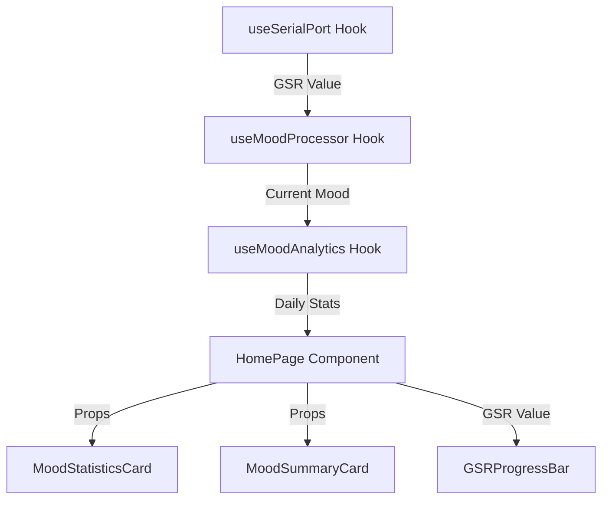

# Design Document: Home UI Redesign

## Overview

本设计文档描述了主页面 UI 重构的技术实现方案。该功能将创建一个全新的主页面布局，展示可爱的角色形象（main.png）、星星装饰（star.png）、GSR 进度条以及情绪统计卡片，提供更加友好和直观的用户体验。

核心设计理念：
- 视觉层次清晰：从上到下依次展示角色、星星、数据可视化
- 信息密度适中：平衡美观性和功能性
- 响应式设计：适配不同屏幕尺寸
- 组件化架构：便于维护和扩展

## Architecture

### Component Structure

```
App.tsx
└── HomePage (new component)
    ├── Header
    │   ├── UserAvatar (left)
    │   └── SettingsIcon (right)
    ├── MainCharacter (main.png)
    ├── StarIcon (star.png)
    ├── GSRProgressBar
    │   ├── MinValue (left)
    │   ├── ProgressBar (center)
    │   └── MaxValue (right)
    └── StatsCardsRow
        ├── MoodStatisticsCard (今日情绪统计)
        └── MoodSummaryCard (专属情绪总结)
```

### Data Flow



### Routing Structure

- `/` - HomePage (新的主页面)
- `/chat` - ChatInterface (聊天界面，从主页面导航)
- `/analytics` - MoodAnalyticsDetail (详细分析页面)

## Components and Interfaces

### 1. HomePage Component

新建的主页面组件，整合所有 UI 元素。

```typescript
interface HomePageProps {
  // 从现有 hooks 获取数据
}

export const HomePage: React.FC<HomePageProps> = () => {
  const { latestValue, smoothedValue } = useSerialPort();
  const { currentMood } = useMoodProcessor(latestValue);
  const { dailyStats } = useMoodAnalytics(currentMood, smoothedValue);
  
  return (
    <div className="home-container">
      <Header />
      <MainCharacter />
      <StarIcon />
      <GSRProgressBar value={smoothedValue} />
      <StatsCardsRow dailyStats={dailyStats} />
    </div>
  );
};
```

### 2. Header Component

顶部导航栏，包含用户头像和设置图标。

```typescript
interface HeaderProps {
  onAvatarClick?: () => void;
  onSettingsClick?: () => void;
}

export const Header: React.FC<HeaderProps> = ({
  onAvatarClick,
  onSettingsClick
}) => {
  return (
    <header className="header">
      <button onClick={onAvatarClick} className="avatar-button">
        {/* User Avatar Icon */}
      </button>
      <div className="username">用户名</div>
      <button onClick={onSettingsClick} className="settings-button">
        {/* Settings Icon */}
      </button>
    </header>
  );
};
```

### 3. MainCharacter Component

显示主角色图像（main.png）。

```typescript
export const MainCharacter: React.FC = () => {
  return (
    <div className="main-character-container">
      
    </div>
  );
};
```

### 4. StarIcon Component

显示星星图标（star.png）。

```typescript
export const StarIcon: React.FC = () => {
  return (
    <div className="star-icon-container">
      
    </div>
  );
};
```

### 5. GSRProgressBar Component

显示 GSR 数值的进度条。

```typescript
interface GSRProgressBarProps {
  value: number;
  min?: number;
  max?: number;
}

export const GSRProgressBar: React.FC<GSRProgressBarProps> = ({
  value,
  min = 0,
  max = 1023
}) => {
  const percentage = ((value - min) / (max - min)) * 100;
  
  return (
    <div className="gsr-progress-container">
      <span className="gsr-min-value">{min}</span>
      <div className="gsr-progress-bar">
        <div 
          className="gsr-progress-fill" 
          style={{ width: `${percentage}%` }}
        />
      </div>
      <span className="gsr-max-value">{max}</span>
    </div>
  );
};
```

### 6. StatsCardsRow Component

横向排列的统计卡片容器。

```typescript
interface StatsCardsRowProps {
  dailyStats: DailyMoodStats | null;
}

export const StatsCardsRow: React.FC<StatsCardsRowProps> = ({
  dailyStats
}) => {
  return (
    <div className="stats-cards-row">
      <MoodStatisticsCard dailyStats={dailyStats} />
      <MoodSummaryCard />
    </div>
  );
};
```

### 7. MoodStatisticsCard Component

复用现有的 `MoodAnalytics` 组件，调整样式以适配新布局。

### 8. MoodSummaryCard Component

新建的专属情绪总结卡片组件。

```typescript
export const MoodSummaryCard: React.FC = () => {
  return (
    <div className="mood-summary-card">
      <h3 className="card-title">专属情绪总结</h3>
      <div className="summary-content">
        {/* 情绪总结内容 */}
      </div>
    </div>
  );
};
```

## Data Models

### GSRData

```typescript
interface GSRData {
  value: number;        // 当前 GSR 值
  min: number;          // 最小值（默认 0）
  max: number;          // 最大值（默认 1023）
  percentage: number;   // 百分比（计算得出）
}
```

### HomePageState

```typescript
interface HomePageState {
  gsrValue: number;
  currentMood: MoodConfigItem;
  dailyStats: DailyMoodStats | null;
  isLoading: boolean;
}
```

## Correctness Properties

*A property is a characteristic or behavior that should hold true across all valid executions of a system-essentially, a formal statement about what the system should do. Properties serve as the bridge between human-readable specifications and machine-verifiable correctness guarantees.*

### Property 1: Main character image aspect ratio preservation
*For any* viewport size, when the main character image is displayed, the image SHALL maintain its original aspect ratio without distortion
**Validates: Requirements 1.2**

### Property 2: Star icon horizontal centering
*For any* container width, when the star icon is displayed, it SHALL be horizontally centered within its container
**Validates: Requirements 2.2**

### Property 3: Star icon spacing consistency
*For any* layout configuration, when both the main character and star icon are displayed, the vertical spacing between them SHALL be within the defined range (e.g., 16-32px)
**Validates: Requirements 2.3**

### Property 4: GSR progress bar value accuracy
*For any* GSR value within the valid range [0, 1023], when the progress bar is rendered, the fill percentage SHALL accurately represent the value as (value / max) * 100
**Validates: Requirements 3.4**

### Property 5: GSR value display consistency
*For any* GSR value, when the progress bar is displayed, the left label SHALL show the minimum value and the right label SHALL show the maximum value
**Validates: Requirements 3.2, 3.3**

### Property 6: Mood statistics count accuracy
*For any* set of mood records, when the mood statistics card is displayed, the total count SHALL equal the sum of all individual mood counts
**Validates: Requirements 4.3**

### Property 7: Mood data display completeness
*For any* non-empty mood data set, when the mood statistics card is displayed, it SHALL show both the count and percentage distribution for each mood type
**Validates: Requirements 4.2**

### Property 8: Cards layout positioning
*For any* viewport width above mobile breakpoint, when both statistics cards are displayed, they SHALL be arranged horizontally in a row
**Validates: Requirements 6.2**

### Property 9: Vertical layout spacing
*For any* set of displayed elements (character, star, progress bar, cards), when the home page is rendered, all elements SHALL be arranged vertically with consistent spacing between adjacent elements
**Validates: Requirements 6.1**

### Property 10: Card styling consistency
*For any* pair of statistics cards (mood statistics and mood summary), when both are displayed, they SHALL have matching border radius, padding, and background opacity values
**Validates: Requirements 5.3**

## Error Handling

### Image Loading Errors

```typescript
// 处理图片加载失败
const handleImageError = (e: React.SyntheticEvent<HTMLImageElement>) => {
  console.error('Image failed to load:', e.currentTarget.src);
  // 显示占位符或默认图像
  e.currentTarget.src = '/placeholder.png';
};


```

### Data Unavailability

```typescript
// 处理数据不可用情况
if (!dailyStats) {
  return <EmptyState message="暂无数据" />;
}
```

### Invalid GSR Values

```typescript
// 验证 GSR 值范围
const clampGSRValue = (value: number, min: number, max: number): number => {
  return Math.max(min, Math.min(max, value));
};
```

## Testing Strategy

### Unit Testing

使用 Vitest 进行单元测试，覆盖：

1. **组件渲染测试**
   - 验证所有组件正确渲染
   - 验证图片 src 属性正确
   - 验证文本内容正确

2. **Props 传递测试**
   - 验证 props 正确传递给子组件
   - 验证回调函数正确触发

3. **边界情况测试**
   - GSR 值为 0 或最大值
   - 空数据状态
   - 图片加载失败

### Property-Based Testing

使用 fast-check 库进行属性测试，配置每个测试运行至少 100 次迭代。

每个属性测试必须：
- 使用注释标记对应的设计文档属性：`// Feature: home-ui-redesign, Property X: [property text]`
- 一个属性对应一个测试
- 生成随机但有效的测试数据

示例：
```typescript
import fc from 'fast-check';

// Feature: home-ui-redesign, Property 4: GSR progress bar value accuracy
test('GSR progress bar accurately represents value percentage', () => {
  fc.assert(
    fc.property(
      fc.integer({ min: 0, max: 1023 }),
      (gsrValue) => {
        const percentage = (gsrValue / 1023) * 100;
        const result = calculateProgressPercentage(gsrValue, 0, 1023);
        expect(result).toBeCloseTo(percentage, 2);
      }
    ),
    { numRuns: 100 }
  );
});
```

### Integration Testing

测试组件间交互：
- HomePage 与子组件的数据流
- 路由导航功能
- 用户交互（点击、导航）

### Visual Regression Testing

使用截图对比确保：
- 布局一致性
- 响应式设计正确
- 样式无意外变化

## Styling Approach

### CSS Framework

继续使用 Tailwind CSS，保持与现有代码风格一致。

### Layout Structure

```css
.home-container {
  display: flex;
  flex-direction: column;
  align-items: center;
  min-height: 100vh;
  padding: 1rem;
  background: linear-gradient(to bottom right, #f8fafc, #e0e7ff);
}

.main-character-container {
  width: 100%;
  max-width: 400px;
  margin: 2rem 0;
}

.main-character-image {
  width: 100%;
  height: auto;
  object-fit: contain;
}

.star-icon-container {
  display: flex;
  justify-content: center;
  margin: 1rem 0;
}

.star-icon-image {
  width: 80px;
  height: 80px;
}

.gsr-progress-container {
  display: flex;
  align-items: center;
  gap: 1rem;
  width: 100%;
  max-width: 500px;
  margin: 1.5rem 0;
}

.gsr-progress-bar {
  flex: 1;
  height: 8px;
  background: #e2e8f0;
  border-radius: 9999px;
  overflow: hidden;
}

.gsr-progress-fill {
  height: 100%;
  background: linear-gradient(to right, #3b82f6, #8b5cf6);
  transition: width 0.3s ease;
}

.stats-cards-row {
  display: flex;
  gap: 1rem;
  width: 100%;
  max-width: 600px;
  margin-top: 2rem;
}

@media (max-width: 640px) {
  .stats-cards-row {
    flex-direction: column;
  }
}
```

### Responsive Breakpoints

- Mobile: < 640px (单列布局)
- Tablet: 640px - 1024px (适中尺寸)
- Desktop: > 1024px (完整布局)

## Performance Considerations

1. **图片优化**
   - 使用适当的图片格式（WebP with PNG fallback）
   - 实现懒加载
   - 提供多种尺寸的图片资源

2. **组件优化**
   - 使用 React.memo 避免不必要的重渲染
   - 使用 useMemo 缓存计算结果
   - 使用 useCallback 缓存回调函数

3. **动画性能**
   - 使用 CSS transforms 而非 position 属性
   - 使用 will-change 提示浏览器优化
   - 限制动画帧率

## Accessibility

1. **语义化 HTML**
   - 使用适当的标签（header, main, section）
   - 提供有意义的 alt 文本

2. **键盘导航**
   - 所有交互元素可通过键盘访问
   - 合理的 tab 顺序

3. **ARIA 属性**
   - 为进度条添加 role="progressbar"
   - 为动态内容添加 aria-live

4. **颜色对比度**
   - 确保文本与背景有足够对比度
   - 不仅依赖颜色传达信息

## Migration Plan

### Phase 1: 创建新组件
- 创建 HomePage 组件
- 创建子组件（Header, MainCharacter, StarIcon, GSRProgressBar, MoodSummaryCard）
- 编写基础样式

### Phase 2: 集成数据
- 连接现有 hooks
- 复用 MoodAnalytics 组件
- 实现数据流

### Phase 3: 路由调整
- 更新 App.tsx 路由配置
- 将当前主页面移至 /chat 路由
- 设置新 HomePage 为默认路由

### Phase 4: 测试和优化
- 编写单元测试
- 编写属性测试
- 性能优化
- 响应式测试

### Phase 5: 部署
- 代码审查
- 用户验收测试
- 生产环境部署
