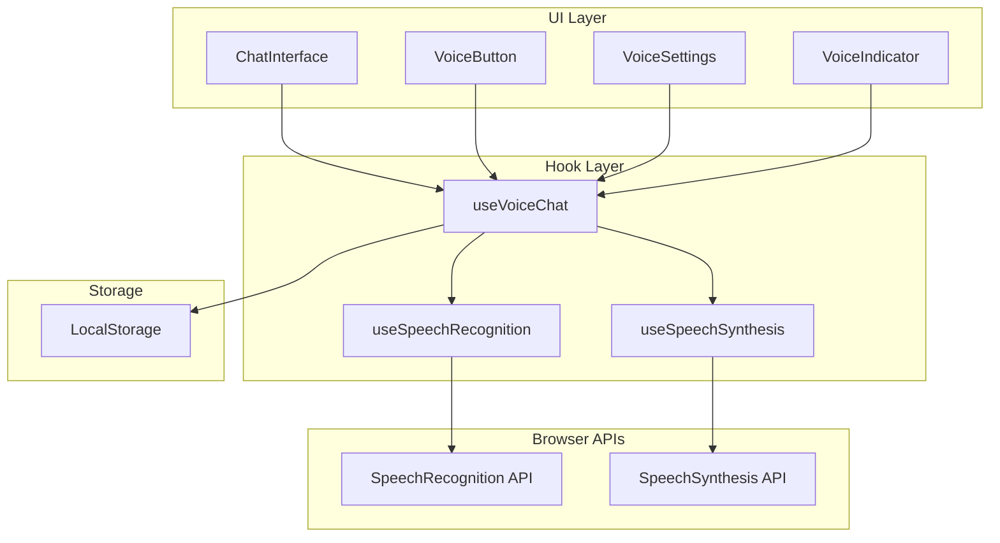
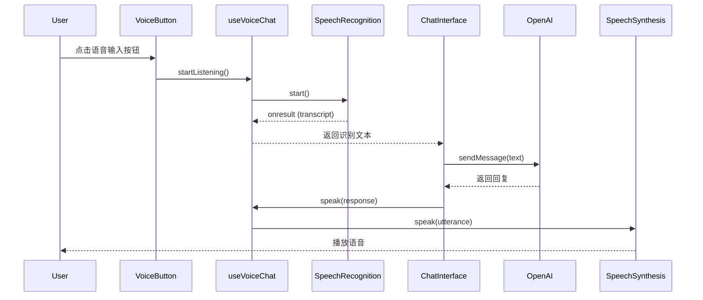
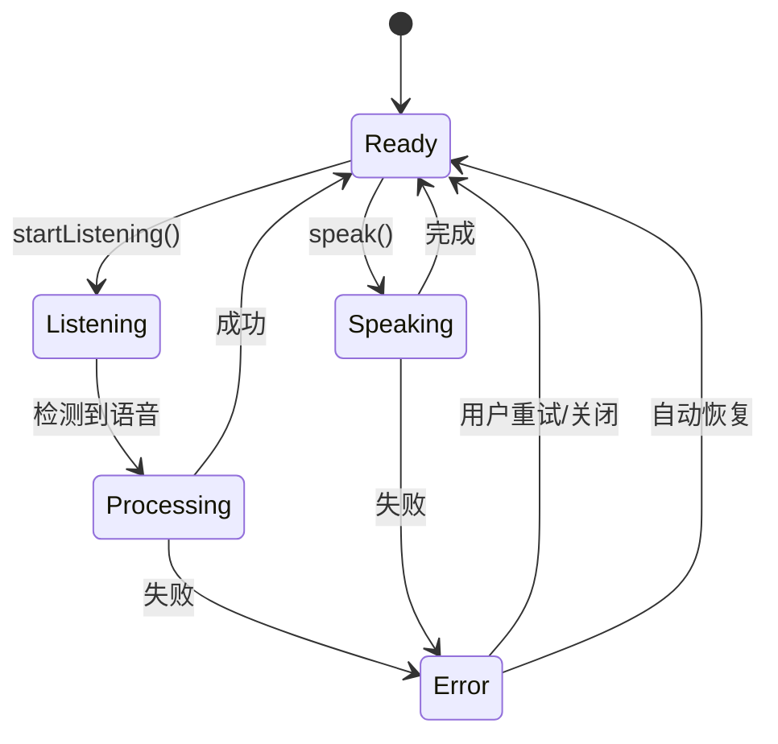

# 设计文档

## 概述

语音聊天功能将为现有的文本聊天系统添加语音输入和输出能力。该功能使用浏览器原生的 Web Speech API（SpeechRecognition 和 SpeechSynthesis），无需额外的后端服务或第三方依赖。设计遵循现有的组件架构模式，通过自定义 Hook 封装语音功能，并与现有的 ChatInterface 组件无缝集成。

核心设计原则：
- 使用浏览器原生 API，零外部依赖
- 通过 React Hooks 封装语音逻辑
- 与现有聊天流程完全兼容
- 渐进增强：不支持的浏览器降级到纯文本模式
- 用户可控：提供清晰的开关和状态反馈

## 架构

### 系统架构图



### 数据流



## 组件和接口

### 1. useSpeechRecognition Hook

封装 Web Speech API 的语音识别功能。

```typescript
interface UseSpeechRecognitionOptions {
  lang?: string;              // 识别语言，默认 'zh-CN'
  continuous?: boolean;       // 是否连续识别，默认 false
  interimResults?: boolean;   // 是否返回临时结果，默认 true
  maxAlternatives?: number;   // 最大候选数，默认 1
}

interface UseSpeechRecognitionReturn {
  isListening: boolean;       // 是否正在监听
  transcript: string;         // 识别的文本
  interimTranscript: string;  // 临时文本（实时）
  isSupported: boolean;       // 浏览器是否支持
  error: string | null;       // 错误信息
  startListening: () => void; // 开始监听
  stopListening: () => void;  // 停止监听
  resetTranscript: () => void;// 重置文本
}

function useSpeechRecognition(
  options?: UseSpeechRecognitionOptions
): UseSpeechRecognitionReturn
```

**实现要点：**
- 检测浏览器支持（webkitSpeechRecognition 或 SpeechRecognition）
- 处理权限请求和拒绝
- 自动停止检测（静默超时）
- 错误处理和重试逻辑

### 2. useSpeechSynthesis Hook

封装 Web Speech API 的语音合成功能。

```typescript
interface VoiceSettings {
  rate: number;      // 语速 (0.1-10)，默认 1
  pitch: number;     // 音调 (0-2)，默认 1
  volume: number;    // 音量 (0-1)，默认 1
  voice: string | null; // 语音名称，默认 null（系统默认）
}

interface UseSpeechSynthesisReturn {
  isSpeaking: boolean;        // 是否正在播放
  isPaused: boolean;          // 是否暂停
  isSupported: boolean;       // 浏览器是否支持
  voices: SpeechSynthesisVoice[]; // 可用语音列表
  settings: VoiceSettings;    // 当前设置
  speak: (text: string) => void;  // 播放文本
  pause: () => void;          // 暂停播放
  resume: () => void;         // 恢复播放
  stop: () => void;           // 停止播放
  updateSettings: (settings: Partial<VoiceSettings>) => void; // 更新设置
}

function useSpeechSynthesis(): UseSpeechSynthesisReturn
```

**实现要点：**
- 加载可用语音列表（异步）
- 优先选择中文语音
- 支持长文本分段播放（避免超时）
- 状态管理（speaking, paused）

### 3. useVoiceChat Hook

整合语音识别和合成，提供统一的语音聊天接口。

```typescript
interface VoiceChatSettings {
  voiceInputEnabled: boolean;   // 语音输入开关
  voiceOutputEnabled: boolean;  // 语音输出开关
  autoSend: boolean;            // 识别完成后自动发送
  speechSettings: VoiceSettings; // 语音合成设置
}

interface UseVoiceChatReturn {
  // 状态
  isListening: boolean;
  isSpeaking: boolean;
  isSupported: {
    recognition: boolean;
    synthesis: boolean;
  };
  settings: VoiceChatSettings;
  
  // 语音识别
  transcript: string;
  interimTranscript: string;
  startListening: () => void;
  stopListening: () => void;
  
  // 语音合成
  speak: (text: string) => void;
  stopSpeaking: () => void;
  
  // 设置
  updateSettings: (settings: Partial<VoiceChatSettings>) => void;
  
  // 错误
  error: string | null;
  clearError: () => void;
}

function useVoiceChat(): UseVoiceChatReturn
```

**实现要点：**
- 持久化设置到 localStorage
- 自动发送逻辑
- 错误统一处理
- 与现有 useChatAPI 协同工作

### 4. ChatInterface 组件增强

在现有 ChatInterface 组件中集成语音功能。

**新增元素：**
- 语音输入按钮（麦克风图标）
- 语音状态指示器（录音动画、播放动画）
- 语音设置面板（可选，通过设置按钮打开）

**修改点：**
```typescript
// 在 ChatInterface 组件中
const {
  isListening,
  isSpeaking,
  transcript,
  interimTranscript,
  startListening,
  stopListening,
  speak,
  stopSpeaking,
  settings,
  updateSettings,
  isSupported,
  error: voiceError,
} = useVoiceChat();

// 监听 transcript 变化，自动填充输入框
useEffect(() => {
  if (transcript && settings.autoSend) {
    setInputValue(transcript);
    // 可选：自动发送
  }
}, [transcript]);

// 监听 AI 回复，自动播放语音
useEffect(() => {
  if (messages.length > 0 && settings.voiceOutputEnabled) {
    const lastMessage = messages[messages.length - 1];
    if (lastMessage.role === 'assistant') {
      speak(lastMessage.content);
    }
  }
}, [messages]);
```

### 5. VoiceButton 组件

语音输入按钮组件，显示不同状态。

```typescript
interface VoiceButtonProps {
  isListening: boolean;
  isSupported: boolean;
  onStart: () => void;
  onStop: () => void;
  disabled?: boolean;
}

function VoiceButton({
  isListening,
  isSupported,
  onStart,
  onStop,
  disabled
}: VoiceButtonProps): JSX.Element
```

**状态样式：**
- 默认：灰色麦克风图标
- 监听中：红色脉动动画
- 不支持：禁用状态
- 禁用：半透明

### 6. VoiceIndicator 组件

语音状态指示器，显示实时反馈。

```typescript
interface VoiceIndicatorProps {
  isListening: boolean;
  isSpeaking: boolean;
  interimTranscript?: string;
}

function VoiceIndicator({
  isListening,
  isSpeaking,
  interimTranscript
}: VoiceIndicatorProps): JSX.Element | null
```

**显示内容：**
- 监听中：显示临时识别文本 + 波形动画
- 播放中：显示"正在播放..." + 音频波形
- 空闲：不显示

## 数据模型

### VoiceChatSettings（存储在 localStorage）

```typescript
interface VoiceChatSettings {
  voiceInputEnabled: boolean;   // 默认: false
  voiceOutputEnabled: boolean;  // 默认: false
  autoSend: boolean;            // 默认: false
  speechSettings: {
    rate: number;               // 默认: 1
    pitch: number;              // 默认: 1
    volume: number;             // 默认: 1
    voice: string | null;       // 默认: null
  };
}
```

**存储键：** `voice-chat-settings`

### 类型定义扩展

在 `src/types.ts` 中添加：

```typescript
// Voice Chat Types
export interface VoiceSettings {
  rate: number;
  pitch: number;
  volume: number;
  voice: string | null;
}

export interface VoiceChatSettings {
  voiceInputEnabled: boolean;
  voiceOutputEnabled: boolean;
  autoSend: boolean;
  speechSettings: VoiceSettings;
}

export interface VoiceError {
  type: 'permission' | 'not_supported' | 'network' | 'unknown';
  message: string;
}
```

## 正确性属性

*属性是一个特征或行为，应该在系统的所有有效执行中保持为真——本质上是关于系统应该做什么的形式化陈述。属性作为人类可读规范和机器可验证正确性保证之间的桥梁。*


### 属性反思

在编写正确性属性之前，我需要识别并消除冗余：

**识别的冗余：**
1. 属性 1.2（监听时显示视觉反馈）和属性 4.1（监听时显示动画指示器）是重复的，可以合并为一个综合属性
2. 属性 2.2（播放时显示状态指示器）和属性 4.3（播放时显示音频波形）是重复的，可以合并
3. 属性 3.3、3.4 和 6.5（保存设置到 localStorage）可以合并为一个通用的设置持久化属性
4. 属性 4.4（显示错误消息）已经被属性 1.5（识别失败显示错误）覆盖，可以合并为一个通用的错误处理属性

**合并后的属性集：**
- 将 1.2 和 4.1 合并为"监听状态视觉反馈"
- 将 2.2 和 4.3 合并为"播放状态视觉反馈"
- 将 3.3、3.4 和 6.5 合并为"设置持久化往返"
- 将 1.5 和 4.4 合并为"错误显示一致性"

### 正确性属性

**属性 1: 语音输入触发录音**
*对于任何* 语音输入按钮点击事件，当用户点击时，系统应该请求麦克风权限并启动语音识别引擎
**验证: 需求 1.1**

**属性 2: 监听状态视觉反馈**
*对于任何* 语音识别监听状态，UI 应该显示相应的视觉反馈指示器（如脉动动画）
**验证: 需求 1.2, 4.1**

**属性 3: 静默自动停止**
*对于任何* 语音识别会话，当检测到超过设定时间的静默时，系统应该自动停止录音并处理语音
**验证: 需求 1.3**

**属性 4: 识别结果显示**
*对于任何* 语音识别完成事件，识别的文本应该显示在聊天界面的输入框中
**验证: 需求 1.4**

**属性 5: 错误显示一致性**
*对于任何* 语音相关错误（识别失败、权限拒绝、不支持等），系统应该显示具体的错误消息和恢复选项
**验证: 需求 1.5, 4.4, 5.1, 5.2, 5.3, 5.4, 5.5**

**属性 6: 自动语音播放**
*对于任何* 系统生成的文本回复，当语音输出启用时，系统应该自动调用语音合成引擎播放该文本
**验证: 需求 2.1, 2.4**

**属性 7: 播放状态视觉反馈**
*对于任何* 语音播放状态，UI 应该显示相应的播放指示器（如音频波形动画）
**验证: 需求 2.2, 4.3**

**属性 8: 停止播放立即生效**
*对于任何* 正在播放的语音，当用户点击停止按钮时，播放应该立即停止
**验证: 需求 2.3**

**属性 9: 播放完成状态更新**
*对于任何* 语音播放完成事件，系统状态应该更新为就绪状态
**验证: 需求 2.5**

**属性 10: 设置持久化往返**
*对于任何* 语音设置（输入开关、输出开关、语速、音调等），保存到 localStorage 后重新加载应该得到相同的设置值
**验证: 需求 3.3, 3.4, 3.5, 6.5**

**属性 11: 处理状态视觉反馈**
*对于任何* 语音处理中状态，UI 应该显示加载指示器
**验证: 需求 4.2**

**属性 12: 状态视觉区分**
*对于任何* 两个不同的语音状态（监听、处理、播放、错误），它们的 UI 表现（颜色、图标）应该是可区分的
**验证: 需求 4.5**

**属性 13: 设置立即应用**
*对于任何* 语音设置调整（语速、音调、音量），新设置应该立即应用到下一次语音播放
**验证: 需求 6.4**

**属性 14: 输入方式一致性**
*对于任何* 消息内容，通过语音输入和文本输入应该产生相同的消息处理流程和结果
**验证: 需求 7.1**

**属性 15: 双重输出一致性**
*对于任何* 系统回复，当语音输出启用时，应该同时显示文本消息和播放语音
**验证: 需求 7.2**

**属性 16: 功能隔离性**
*对于任何* 文本聊天操作，在语音功能存在的情况下，应该与没有语音功能时产生相同的结果
**验证: 需求 7.5**

## 错误处理

### 错误类型

```typescript
type VoiceErrorType = 
  | 'permission'      // 麦克风权限被拒绝
  | 'not_supported'   // 浏览器不支持
  | 'network'         // 网络错误（在线识别服务）
  | 'no_speech'       // 未检测到语音
  | 'aborted'         // 用户中止
  | 'unknown';        // 未知错误

interface VoiceError {
  type: VoiceErrorType;
  message: string;
  details?: any;
}
```

### 错误处理策略

**1. 权限错误（permission）**
- 显示友好的权限请求说明
- 提供手动授权指引链接
- 允许用户重试
- 降级到纯文本模式

**2. 不支持错误（not_supported）**
- 检测浏览器能力
- 隐藏不支持的功能按钮
- 显示浏览器升级建议
- 优雅降级，不影响文本聊天

**3. 网络错误（network）**
- 显示网络错误提示
- 提供重试按钮
- 考虑离线模式（如果浏览器支持）

**4. 无语音错误（no_speech）**
- 提示用户重新说话
- 检查麦克风是否正常工作
- 提供音量指示器

**5. 中止错误（aborted）**
- 静默处理，不显示错误
- 重置状态为就绪

**6. 未知错误（unknown）**
- 记录错误详情到控制台
- 显示通用错误消息
- 提供重试选项

### 错误恢复流程



## 测试策略

### 单元测试

使用 Vitest 进行单元测试，覆盖以下场景：

**1. useSpeechRecognition Hook**
- 浏览器支持检测
- 开始/停止监听
- 文本识别结果处理
- 错误处理（权限拒绝、不支持）
- 静默超时逻辑

**2. useSpeechSynthesis Hook**
- 浏览器支持检测
- 语音列表加载
- 播放/暂停/停止
- 设置应用（语速、音调、音量）
- 长文本分段

**3. useVoiceChat Hook**
- 设置持久化和恢复
- 语音识别和合成的协调
- 自动发送逻辑
- 错误统一处理

**4. 组件测试**
- VoiceButton 状态渲染
- VoiceIndicator 动画显示
- ChatInterface 集成

### 属性测试

使用 fast-check 进行属性测试，验证正确性属性：

**测试库选择：** fast-check（TypeScript/JavaScript 的属性测试库）

**配置要求：**
- 每个属性测试至少运行 100 次迭代
- 使用随机种子确保可重现性

**属性测试用例：**

1. **设置持久化往返测试（属性 10）**
   - 生成随机的 VoiceChatSettings
   - 保存到 localStorage
   - 重新加载
   - 验证设置相同

2. **输入方式一致性测试（属性 14）**
   - 生成随机消息内容
   - 分别通过语音和文本输入
   - 验证消息处理流程相同

3. **双重输出一致性测试（属性 15）**
   - 生成随机回复内容
   - 启用语音输出
   - 验证文本显示和语音播放都发生

4. **功能隔离性测试（属性 16）**
   - 生成随机文本聊天操作序列
   - 在有/无语音功能的环境中执行
   - 验证结果相同

5. **状态视觉区分测试（属性 12）**
   - 遍历所有语音状态
   - 验证每个状态有唯一的视觉表现

6. **错误显示一致性测试（属性 5）**
   - 生成不同类型的错误
   - 验证每个错误都显示了消息和恢复选项

### 集成测试

**1. 端到端语音流程**
- 用户点击语音按钮 → 说话 → 识别 → 发送 → 接收回复 → 播放语音

**2. 设置变更流程**
- 调整语音设置 → 保存 → 刷新页面 → 验证设置恢复

**3. 错误恢复流程**
- 触发错误 → 显示错误 → 用户重试 → 成功恢复

**4. 浏览器兼容性测试**
- Chrome（支持）
- Firefox（支持）
- Safari（部分支持）
- Edge（支持）

### 测试覆盖目标

- 单元测试覆盖率：> 80%
- 属性测试：覆盖所有核心正确性属性
- 集成测试：覆盖主要用户流程
- 边缘情况：覆盖所有错误类型

## 性能考虑

### 1. 语音识别性能

- 使用 `continuous: false` 模式减少资源消耗
- 设置合理的静默超时（1.5-2 秒）
- 避免频繁启动/停止识别

### 2. 语音合成性能

- 长文本分段播放（每段 < 200 字符）
- 避免同时播放多个语音
- 使用队列管理多个播放请求

### 3. 内存管理

- 及时清理 SpeechRecognition 和 SpeechSynthesisUtterance 实例
- 避免内存泄漏（事件监听器清理）
- 限制语音历史记录数量

### 4. 用户体验优化

- 提供视觉反馈减少感知延迟
- 使用防抖避免频繁操作
- 预加载语音列表

## 浏览器兼容性

### Web Speech API 支持情况

| 浏览器 | SpeechRecognition | SpeechSynthesis | 备注 |
|--------|-------------------|-----------------|------|
| Chrome | ✅ 完全支持 | ✅ 完全支持 | 推荐 |
| Edge | ✅ 完全支持 | ✅ 完全支持 | 推荐 |
| Firefox | ❌ 不支持 | ✅ 完全支持 | 仅语音输出 |
| Safari | ✅ 部分支持 | ✅ 完全支持 | 需要用户交互 |
| Opera | ✅ 完全支持 | ✅ 完全支持 | - |

### 降级策略

1. **检测支持情况**
   ```typescript
   const isSpeechRecognitionSupported = 
     'SpeechRecognition' in window || 'webkitSpeechRecognition' in window;
   
   const isSpeechSynthesisSupported = 
     'speechSynthesis' in window;
   ```

2. **条件渲染**
   - 不支持的功能不显示按钮
   - 显示浏览器升级提示

3. **优雅降级**
   - 语音功能失败不影响文本聊天
   - 提供纯文本替代方案

## 安全考虑

### 1. 权限管理

- 仅在用户主动操作时请求麦克风权限
- 清晰说明权限用途
- 尊重用户拒绝权限的选择

### 2. 隐私保护

- 语音识别在浏览器本地或通过 HTTPS 进行
- 不存储语音录音
- 仅存储识别后的文本

### 3. 数据安全

- 语音设置存储在本地 localStorage
- 不包含敏感信息
- 可随时清除

## 可访问性

### 1. 键盘支持

- 语音按钮可通过 Tab 键聚焦
- 支持 Enter/Space 键触发
- 提供键盘快捷键（可选）

### 2. 屏幕阅读器

- 为语音按钮提供 aria-label
- 状态变化通过 aria-live 通知
- 错误消息可被屏幕阅读器读取

### 3. 视觉反馈

- 不仅依赖颜色区分状态
- 提供图标和文本标签
- 动画可选择性禁用

## 未来扩展

### 1. 多语言支持

- 自动检测用户语言
- 支持语言切换
- 多语言语音选择

### 2. 高级功能

- 语音命令（如"发送"、"取消"）
- 语音情感分析
- 实时字幕显示

### 3. 离线支持

- 使用浏览器离线识别（如果支持）
- 缓存常用语音
- 离线模式提示

### 4. 自定义语音

- 支持第三方语音引擎
- 自定义语音模型
- 语音克隆（高级功能）
